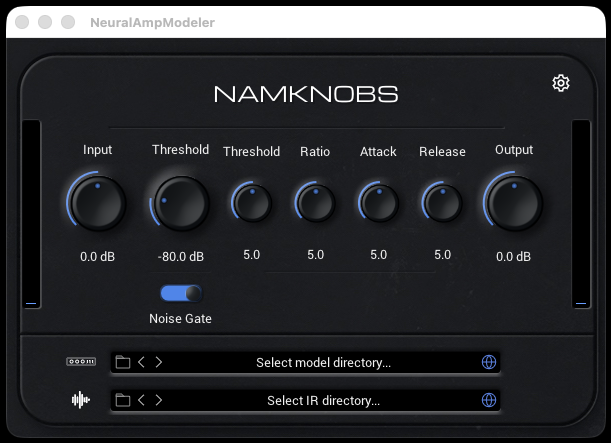

# NAMKnobs

**A real-time parametric guitar-pedal plugin.** NAMKnobs loads [Neural Amp Modeler](https://github.com/sdatkinson/neural-amp-modeler) (`.nam`) models whose **knobs are live inputs to the neural net** — so one model *is* the whole pedal across all its knob positions, rather than a single captured snapshot. It's a fork of the [NAM plugin](https://github.com/sdatkinson/NeuralAmpModelerPlugin) (built with [iPlug2](https://iplug2.github.io)); mono in / mono out, so it sits **in front of** your NAM amp and **stacks** like real pedals.

> **[⬇ Download the latest release](https://github.com/drockthedoc/NAMKnobs-plugin/releases/latest)** — VST3 + AU (macOS) / VST3 (Windows), plus 7 pedal models. See **[INSTALL_NAMKNOBS.md](INSTALL_NAMKNOBS.md)**.

*Above: the Compressor model loaded — the plugin shows that pedal's four knobs (Threshold / Ratio / Attack / Release). Load the RAT and you'd see Distortion / Filter / Volume instead. (Screenshot captured automatically in CI.)*

## What makes it different

- **The right knobs for each pedal.** On model load, NAMKnobs shows *exactly* the knobs that pedal has, labelled from the model's own metadata — RAT → *Distortion, Filter*; MXR → one *Distortion*; Compressor → *Threshold / Ratio / Attack / Release*. Unused slots and the amp tone stack are hidden.
- **Real time, any host rate.** Knob motion is one-pole smoothed (~5 ms) so it's click-free, and controls are injected at the model's rate inside the resampler, so they survive 44.1 / 48 / 88.2 / 96 kHz unchanged.
- **Coexists with stock NAM.** Installs as `NAMKnobs.vst3` / `.component` with its own VST3/AU IDs and macOS ObjC prefix — distinct file, distinct ID, safe to run alongside NAM.

## Bundled pedals (`models/`)

| Pedal | Knobs |
|---|---|
| RAT | Distortion, Filter |
| Tube Screamer | Drive, Tone |
| Big Muff (Green Russian) | Sustain, Tone |
| MXR Distortion+ | Distortion |
| Boss DS-1 | Dist, Tone |
| Fuzz Face | Fuzz |
| Compressor | Threshold, Ratio, Attack, Release |

These are our own trained models (WaveNet; the compressor is an LSTM), *based on* the named circuits and not affiliated with the manufacturers. See [models/README.md](models/README.md).

## How it's verified

Everything is checked in CI on real macOS + Windows runners (no Linux plugin target):

- **Build + [`pluginval`](https://github.com/Tracktion/pluginval)** — VST3 + AU load, state, parameter, and real-time-safety validation.
- **Per-control contract** ([`ci/verify_parametric.cpp`](ci/README.md)) — every knob on every bundled model is swept independently and must measurably change the sound.
- **Multi-rate survival** ([`ci/verify_resample.cpp`](ci/README.md)) — controls reach the model unchanged at 44.1 / 48 / 88.2 / 96 kHz.

The one thing CI can't check is how the dynamic knob layout *looks* — that wants a human in a DAW.

## Building

Build scripts live in [`NeuralAmpModeler/scripts/`](NeuralAmpModeler/scripts/) (`makedist-mac.sh` / `makedist-win.bat`); the [build workflow](.github/workflows/build-native.yml) shows the exact steps. Supported: Windows 10 (64-bit)+ and macOS 10.15+. A source-level bundle rename (rather than the CI post-build rename used today) is documented in [RENAME_PLAN.md](RENAME_PLAN.md).

## Credits

NAMKnobs is a fork of the **Neural Amp Modeler plugin** by [Steven Atkinson](https://github.com/sdatkinson) — the entire NAM core, the plugin foundation, and the iPlug2 integration are his (and [Oli Larkin](https://github.com/olilarkin)'s). This fork adds the parametric-pedal layer (per-model knobs from `.nam` metadata) on top. Please support the upstream project:

- Neural Amp Modeler: https://github.com/sdatkinson/neural-amp-modeler
- NAM plugin: https://github.com/sdatkinson/NeuralAmpModelerPlugin
- https://www.youtube.com/user/RunawayThumbtack

For a plain (non-parametric) NAM on Linux, see the [LV2 plugin](https://github.com/mikeoliphant/neural-amp-modeler-lv2).

### Graphics backend note (inherited from NAM)

If the plugin crashes before the GUI appears, you may have an unsupported graphics configuration — typically a Windows system with a dedicated GPU while the host uses integrated graphics. In the control panel, set NAMKnobs (or your DAW) to use your graphics card.
